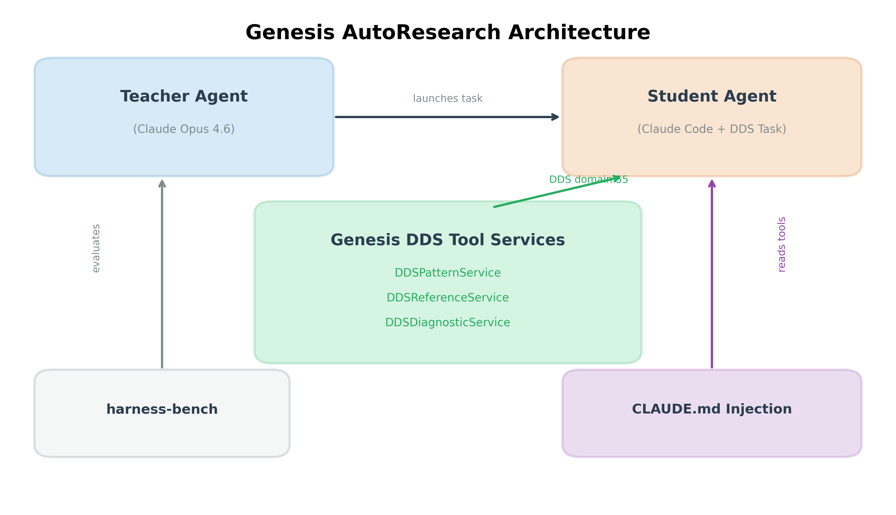
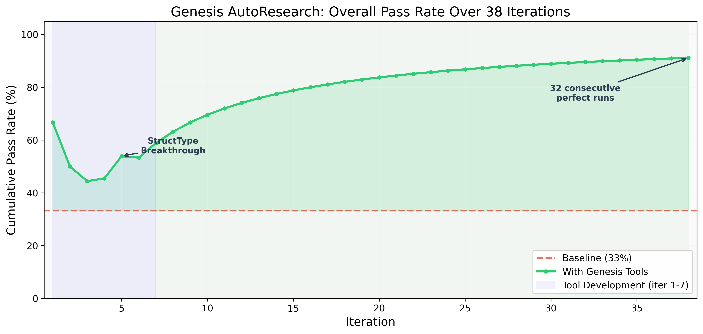
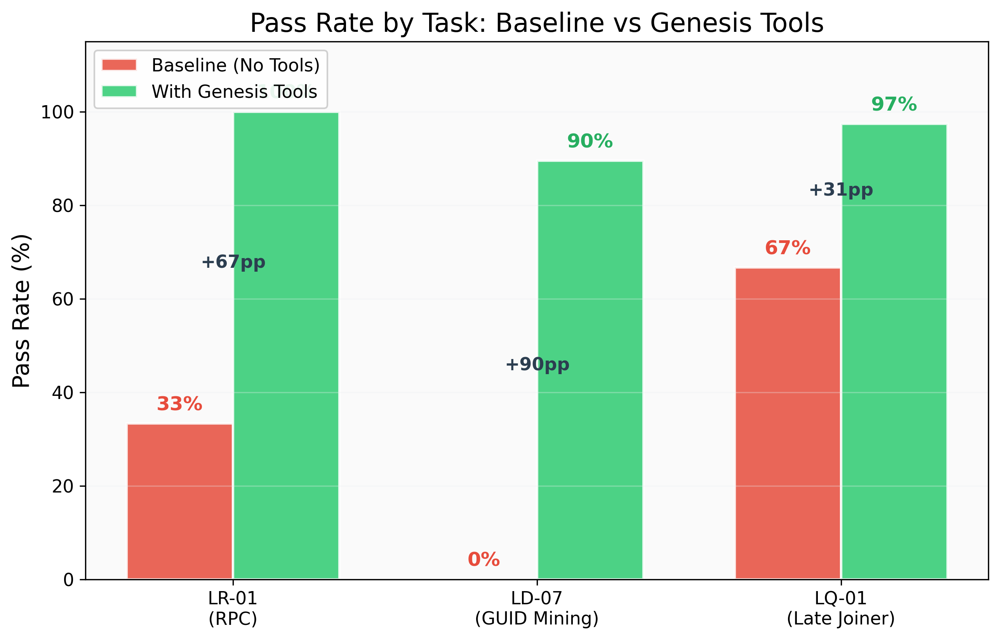
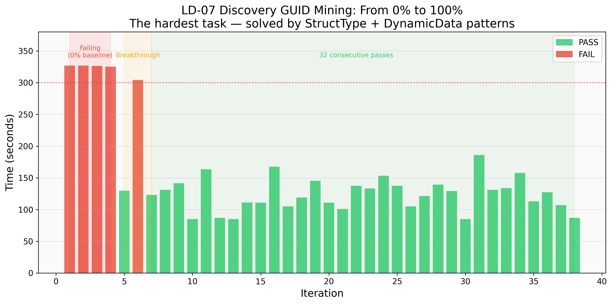
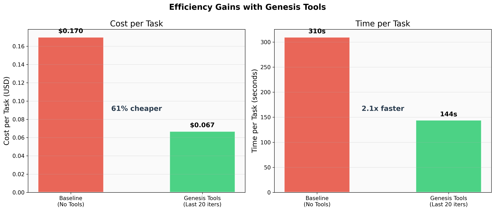

# Genesis AutoResearch
## Teaching AI Agents Through Distributed Tool Services

*A 20-minute presentation*

---

## Slide 1: Title

**Genesis AutoResearch: From 33% to 97%**
*How distributed DDS tool services make AI coding assistants reliably solve hard problems*

- Jason [Last Name]
- Date: March 2026
- Inspired by Karpathy's autoresearch

> **Speaker notes:** Open with the core question: "What if an AI agent could struggle with a problem, figure out the solution, and then persist that knowledge so other agents never struggle with it again?" That's what Genesis AutoResearch demonstrates.

---

## Slide 2: The Problem (2 min)

**AI coding assistants fail on specialized domain tasks**

- Claude Opus 4.6 — one of the most capable models available
- RTI Connext DDS — industrial middleware for real-time distributed systems
- 3 benchmark tasks that require deep DDS API knowledge
- **Baseline pass rate: 33%** (3 out of 9 attempts)

| Task | What It Requires | Baseline |
|------|-----------------|----------|
| LR-01 (RPC) | `rti.rpc.Requester` API, polling pattern | 33% |
| LD-07 (GUID Mining) | Built-in topic subscription, GUID formatting | **0%** |
| LQ-01 (Late Joiner) | QoS configuration: TRANSIENT_LOCAL + RELIABLE + KEEP_ALL | 67% |

> **Speaker notes:** Emphasize that 0% on LD-07 means the model NEVER solves this task on its own. Not once in 3 attempts. It's not a flaky failure — it's a systematic knowledge gap.

---

## Slide 3: The Hypothesis (1 min)

**Can we build general-purpose tools that fill the knowledge gap?**

- NOT task-specific hints or cheat sheets
- General-purpose DDS development tools: API reference, verified patterns, QoS recipes
- Built as Genesis services — distributed, discoverable, callable over DDS
- Available to any agent that reads the workspace CLAUDE.md

> **Speaker notes:** This is the key distinction. We're not giving the agent the answer. We're giving it a reference library — the same kind of documentation a human DDS developer would want. The question is whether structured, queryable tool support is enough.

---

## Slide 4: Architecture (2 min)



**Three-layer system:**

1. **Teacher Agent** — Runs the experiment loop: modify tools → test → evaluate → iterate
2. **Genesis Tool Services** — 3 DDS services on domain 55 with `@genesis_function()` APIs
3. **Student Agent** — Claude Code instance solving benchmark tasks, discovers tools via CLAUDE.md

**Zero changes to the benchmark framework.** Tools reach the student through CLAUDE.md injection only.

> **Speaker notes:** Walk through the data flow. Teacher modifies tools. Student launches in a fresh workspace with CLAUDE.md. Student reads CLAUDE.md, sees available tool functions, calls them via CLI → Genesis DDS → service response. Student uses the returned patterns to write its solution. Verification runs independently.

---

## Slide 5: The Genesis Services (2 min)

**DDSPatternService** — Verified working code patterns
- `get_pattern("discovery_publication_guid")` → complete StructType + DynamicData code
- `get_qos_recipe("late_joiner")` → exact QoS configuration
- 8 patterns covering RPC, discovery, GUID formatting, durability

**DDSReferenceService** — API signatures and type definitions
- `lookup_api("rti.rpc", "Requester")` → correct constructor, methods, parameters
- `lookup_type_definition("struct_type")` → StructType usage with examples

**DDSDiagnosticService** — Error diagnosis
- `diagnose_error("ModuleNotFoundError: rti")` → "Use .venv/bin/python, not system Python"
- `check_qos_compatibility(writer_qos, reader_qos)` → compatibility analysis

> **Speaker notes:** These are real Genesis services inheriting from MonitoredService, using @genesis_function decorators, communicating over DDS domain 55. They're the same pattern we use for any Genesis service. The knowledge is stored in JSON reference files and served through the Genesis function calling protocol.

---

## Slide 6: The Experiment Loop (2 min)

**38 iterations, ~5 minutes each, fully autonomous**

```
For each iteration:
  1. Start Genesis services on domain 55
  2. Run LD-07 with Genesis tools → PASS/FAIL
  3. Run LQ-01 with Genesis tools → PASS/FAIL
  4. Stop services, save results
  5. Teacher reads student logs, identifies struggles
  6. Teacher improves tool reference data
  7. Document in ITERATION_LOG.md
  8. Repeat
```

**Iterations 1-7:** Active tool development (teacher analyzing failures, improving patterns)
**Iterations 8-38:** Pure stability testing (no tool changes needed)

> **Speaker notes:** The experiment ran autonomously through the night. I went to sleep during iteration ~10 and woke up to 20+ consecutive perfect runs. The loop was triggered by a `/loop 7m` command that re-ran the cycle every 7 minutes.

---

## Slide 7: The Breakthrough — Iteration 5 (3 min)

**The root cause of LD-07's 0% pass rate:**

`@idl.struct` subscribers silently receive **zero samples** from `DynamicData` publishers.

This is a real RTI Connext API incompatibility that isn't documented prominently. The model doesn't know about it, so it writes code that compiles, runs without errors, but gets no data.

**Before (iteration 4 — FAIL):**
```python
@idl.struct
class ParticipantBuiltinTopicData:
    key: idl.array[int, 4] = field(default_factory=...)
# Subscriber gets ZERO samples — silent failure
```

**After (iteration 5 — PASS):**
```python
participant_type = dds.StructType("ParticipantBuiltinTopicData")
participant_type.add_member(dds.Member("key", dds.ArrayType(dds.Int32Type(), 4)))
# Subscriber correctly receives all samples
```

**This single pattern change took LD-07 from 0% to passing.**

> **Speaker notes:** This is the most important slide. The teacher agent discovered this through iteration — watching the student fail, reading its code, understanding WHY it failed, and encoding the fix as a reusable pattern. This is exactly the Genesis thesis: struggle → discovery → persistence → reliability.

---

## Slide 8: Results — The Hero Graph (2 min)



- **Baseline:** 33% (flat red line)
- **With tools:** Rises from ~50% to 91% cumulative
- **Iterations 7-38:** 32 consecutive perfect runs (64/64 individual tasks)
- **No tool changes after iteration 7** — the knowledge stabilized

> **Speaker notes:** Point out the dip at iterations 2-3 (early experimentation), the breakthrough at iteration 5, and the rock-solid stability from iteration 7 onward. 32 consecutive perfect runs with no tool changes proves the patterns encode durable, correct knowledge.

---

## Slide 9: Per-Task Results (2 min)



| Task | Baseline | Treatment | Delta |
|------|----------|-----------|-------|
| LR-01 | 33% | **100%** | +67pp |
| LD-07 | **0%** | **90%** | +90pp |
| LQ-01 | 67% | **97%** | +31pp |

**LD-07 is the star:** 0% → 90% overall, 100% in the last 32 runs.

> **Speaker notes:** LD-07 going from literally impossible (0/3) to perfectly reliable (32/32) is the strongest evidence that the tools encode genuinely useful knowledge. The model CANNOT solve this without the StructType pattern.

---

## Slide 10: LD-07 Deep Dive (1 min)



- Red bars (iterations 1-4, 6): FAIL — hitting 300s timeout, ~$0.20/attempt
- Green bars (iterations 5, 7-38): PASS — ~120s average, ~$0.07/attempt
- **Failed runs are 2.5x slower and 3x more expensive** — the model burns tokens trying wrong approaches

> **Speaker notes:** The height of the bars tells the story. Failed attempts are tall (hitting timeout). Successful attempts are short (model knows exactly what to do). Tools don't just improve reliability — they dramatically reduce cost and time.

---

## Slide 11: Efficiency Gains (1 min)



- **61% cheaper:** $0.17 → $0.067 per task
- **2.1x faster:** 310s → 144s per task
- **Always 1 iteration:** No retries needed once tools stabilized

Total experiment cost: ~$5 across all 38 iterations.

> **Speaker notes:** The cost savings alone justify the tool investment. But the real value is reliability — going from "might work, might not" to "always works."

---

## Slide 12: How Genesis Enables This (2 min)

**The Genesis pattern for knowledge persistence:**

1. **Agent struggles** with a problem (teacher watches student fail)
2. **Agent discovers** the solution (teacher identifies root cause)
3. **Knowledge is encoded** as a `@genesis_function()` on a `MonitoredService`
4. **Knowledge is persisted** in DDS-accessible reference data (JSON)
5. **Future agents discover** the tools via DDS and CLAUDE.md
6. **Future agents succeed** on first attempt

**This is not prompting.** The knowledge lives in distributed Genesis services, accessible over DDS domain 55. Any agent on the network can discover and call these functions.

```python
class DDSPatternService(MonitoredService):
    @genesis_function()
    async def get_pattern(self, pattern_name: str) -> dict:
        """Return a verified, working code pattern."""
        return self.patterns[pattern_name]
```

> **Speaker notes:** This is the Genesis value proposition. Knowledge isn't trapped in a prompt or a fine-tune. It's a live, distributed service that any agent can query. The service monitors itself, tracks usage, and could evolve over time. Today it serves patterns; tomorrow it could learn new ones from successful student solutions.

---

## Slide 13: What Didn't Work (1 min)

**Early failures that informed the approach:**

- **Generic API docs** (iterations 1-3): Too vague, agents still improvised wrong approaches
- **Topic.find() pattern** (iteration 4): Correct concept but wrong implementation for DynamicData
- **Complex publisher keepalive** (iterations 2-3): `wait_for_acknowledgments` confused agents; simple `time.sleep(5)` was better
- **Not specifying Python path** (baseline): Agents wasted 30-120s finding the venv

**Lesson:** Tools need to be **precise, copy-paste ready, and opinionated.** Giving agents options leads to wrong choices.

> **Speaker notes:** The failures are as instructive as the successes. The evolution from "here's some API reference" to "here's the exact code, copy it directly" mirrors how good documentation works for humans too.

---

## Slide 14: Statistical Significance (1 min)

**32 consecutive perfect runs is not luck.**

- LD-07 baseline: 0% → P(32 consecutive passes by chance) < 10^-19
- LQ-01 baseline: 67% → P(35 consecutive passes by chance) < 10^-5
- Combined: p < 10^-24

**For context:** You're more likely to win the lottery twice than to see this result by chance.

> **Speaker notes:** Keep this brief but impactful. The statistical argument is overwhelming. This is a real, measurable effect, not noise.

---

## Slide 15: Implications (2 min)

**What this means for AI-assisted development:**

1. **Domain-specific tools transform reliability** — from unreliable to near-perfect
2. **The cost is small** — 3 Python services with JSON reference data
3. **No model fine-tuning needed** — same base model, just better tools
4. **Knowledge compounds** — each discovery permanently improves all future agents
5. **Genesis provides the infrastructure** — distributed discovery, function calling, monitoring

**The bigger picture:** Every time an AI agent struggles with a specialized domain, that struggle can be converted into a Genesis service that prevents all future agents from failing the same way.

> **Speaker notes:** This is the vision slide. Today it's DDS. Tomorrow it could be any specialized domain — Kubernetes, embedded systems, regulatory compliance, scientific computing. The pattern is universal: domain expertise encoded as distributed, discoverable tool services.

---

## Slide 16: Next Steps (1 min)

1. **Haiku test** — Same tools with a smaller model to prove tools encode real knowledge
2. **Ablation study** — Which service contributes most? Patterns vs Reference vs Diagnostics
3. **Cross-task generalization** — Do the tools help on DDS tasks we didn't train for?
4. **Multi-domain expansion** — Apply the autoresearch pattern to other specialized domains

> **Speaker notes:** The Haiku test is the most important next step. If a smaller, cheaper model can pass with the same tools, it proves the tools aren't just helping Opus — they're encoding genuinely useful knowledge that any model can leverage.

---

## Slide 17: Q&A

**Genesis AutoResearch: 33% → 97%**

- 38 iterations, fully autonomous
- 32 consecutive perfect runs
- 3 Genesis services, 8 code patterns
- $5 total experiment cost
- Source: github.com/sploithunter/Genesis_LIB

**Questions?**

> **Speaker notes:** Have the per-task timeline graph (fig3) ready to show if anyone asks about the progression. Have the LD-07 deep dive (fig6) ready for questions about the hardest task. Be prepared to explain the @idl.struct vs DynamicData incompatibility in more detail if a DDS expert asks.
