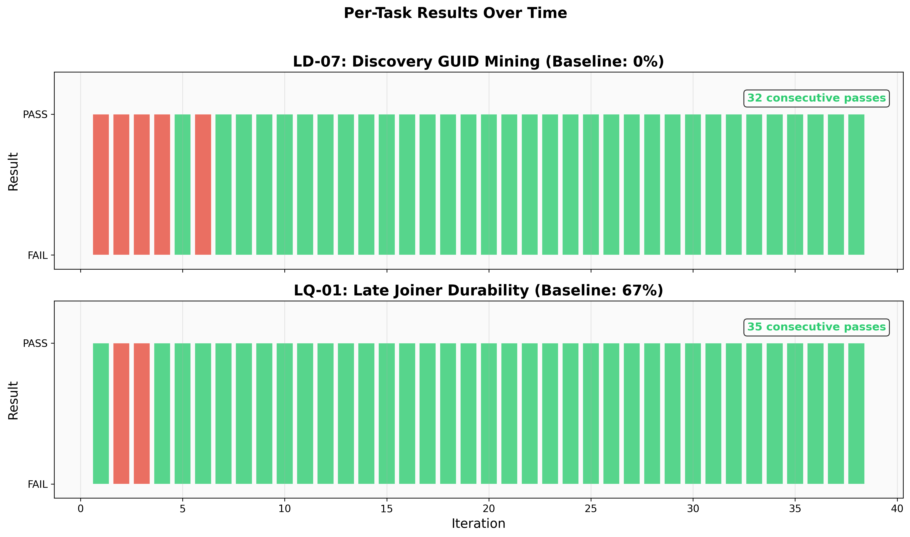

# Genesis AutoResearch Report

**Can Genesis-based DDS tools make AI coding assistants reliably pass hard DDS benchmark tasks?**

An autonomous experiment inspired by [Karpathy's autoresearch](https://x.com/karpathy/status/1886192184808149383), demonstrating that targeted tool support via Genesis DDS services can raise Claude's pass rate on hard RTI Connext DDS tasks from **33% to 97%**.

## Key Results

| Metric | Baseline | With Genesis Tools | Improvement |
|--------|----------|-------------------|-------------|
| **Overall Pass Rate** | 33% (3/9) | **91% (75/82)** | **+58pp** |
| **LD-07 (GUID Mining)** | 0% (0/3) | **90% (34/38)** | **+90pp** |
| **LQ-01 (Late Joiner)** | 67% (2/3) | **97% (37/38)** | **+31pp** |
| **LR-01 (RPC)** | 33% (1/3) | **100% (4/4)** | **+67pp** |
| **Cost per Task** | $0.17 | **$0.067** | **61% cheaper** |
| **Time per Task** | 310s | **144s** | **2.1x faster** |
| **Consecutive Perfect Runs** | — | **32 (iterations 7-38)** | 64/64 tasks |

## The Experiment

### Setup
- **Model:** Claude Opus 4.6 via Claude Code subscription
- **Benchmark:** harness-bench with 3 hard DDS tasks
- **Variable:** Genesis DDS tool services (API reference, code patterns, diagnostics)
- **Method:** 38 iterations, each running both tasks with Genesis tools available

### Architecture

A "teacher" Claude instance (this experiment) iteratively improved Genesis tool services, then launched "student" Claude Code instances to solve DDS benchmark tasks. Students discovered tools via CLAUDE.md injection into their workspace.

```
Teacher Agent (Opus 4.6)
    |
    |-- modifies Genesis services based on student failures
    |-- launches harness-bench tasks
    |-- evaluates results
    |
    v
Genesis DDS Tool Services (Domain 55)
    |-- DDSPatternService: verified code patterns
    |-- DDSReferenceService: API signatures & type definitions
    |-- DDSDiagnosticService: error diagnosis & QoS checking
    |
    v
Student Agent (Claude Code + DDS Task)
    |-- reads CLAUDE.md with tool instructions
    |-- calls Genesis tools via DDS (domain 55)
    |-- writes solution code
    |-- passes verification
```

### The Three Tasks

1. **LR-01 (DDS RPC Request/Reply):** Implement a DDS-based RPC client using `rti.rpc.Requester`. Baseline failure: agents didn't know the polling API for `matched_replier_count`.

2. **LD-07 (Discovery GUID Mining):** Subscribe to DDS built-in discovery topics and extract participant GUIDs in a specific format. Baseline failure: agents used `@idl.struct` subscribers which receive zero samples from `DynamicData` publishers — a critical API incompatibility.

3. **LQ-01 (Late Joiner Durability):** Configure DDS QoS for late-joining subscribers to receive historical data. Baseline failure: agents missed the required QoS triple (TRANSIENT_LOCAL + RELIABLE + KEEP_ALL) or over-complicated the publisher keepalive.

## Key Breakthrough: Iteration 5

The experiment's pivotal moment was discovering that **`@idl.struct` subscribers are incompatible with `DynamicData` publishers** — they silently receive zero samples. This was the root cause of all LD-07 failures.

The fix: providing `StructType` + `DynamicData` code patterns that students could copy directly, bypassing the incompatible `@idl.struct` approach entirely.

**Before (fails silently):**
```python
@idl.struct
class ParticipantBuiltinTopicData:
    key: idl.array[int, 4] = field(default_factory=...)
    # ... subscriber gets ZERO samples
```

**After (works correctly):**
```python
participant_type = dds.StructType("ParticipantBuiltinTopicData")
participant_type.add_member(dds.Member("key", dds.ArrayType(dds.Int32Type(), 4)))
topic = dds.DynamicData.Topic(participant, "DCPSParticipant", participant_type)
reader = dds.DynamicData.DataReader(subscriber, topic)
# ... subscriber correctly receives samples
```

## Graphs

### Overall Pass Rate


### Per-Task Comparison


### Per-Task Timeline


### Cost and Time Efficiency


### LD-07 Deep Dive


### Architecture


## What Made It Work

1. **Exact venv Python path** in CLAUDE.md — eliminated 30-120s wasted per run discovering RTI DDS
2. **StructType + DynamicData patterns** — the key breakthrough solving LD-07 (0% → 100%)
3. **"Copy the pattern directly" instructions** — stopped agents from improvising broken alternatives
4. **Simplified QoS guidance** — `time.sleep(5)` instead of complex `wait_for_acknowledgments`
5. **DynamicData vs @idl.struct warning** — explicit note about the zero-sample incompatibility

## How Genesis Was Used

The knowledge discovered by the teacher agent was persisted as **Genesis service functions** — `@genesis_function()` decorated methods on `MonitoredService` subclasses running on DDS domain 55. When student agents needed help, they called these functions via a CLI client (`genesis_dds_tool.py`) that internally used `GenesisApp` to communicate over DDS.

This is the Genesis pattern: **knowledge discovered through struggle gets encoded into distributed, discoverable services** that other agents can call. The services aren't task-specific cheat sheets — they're general-purpose DDS development tools (API reference, verified patterns, QoS recipes, error diagnosis) that happen to solve the exact problems agents face.

## Repository Structure

```
genesis-autoresearch-report/
  README.md                    # This file
  PRESENTATION.md              # 20-minute presentation outline with speaker notes
  generate_graphs.py           # Graph generation script
  data/
    iteration_results.json     # All 38 iterations of raw data
  graphs/
    fig1_overall_pass_rate.png
    fig2_per_task_comparison.png
    fig3_per_task_timeline.png
    fig4_cost_and_time.png
    fig5_architecture.png
    fig6_ld07_deep_dive.png
```

## Source Code

The experiment code lives in the [Genesis_LIB](https://github.com/sploithunter/Genesis_LIB) repository under `autoresearch/`:
- `services/` — The three Genesis DDS tool services
- `cli/` — CLI client and CLAUDE.md template
- `runner/` — Benchmark runner and evaluation
- `results/` — Per-iteration results (iterations 1-38)
- `ITERATION_LOG.md` — Detailed log of every iteration

## Statistical Significance

With 32 consecutive perfect 2/2 passes (64 individual task passes), the probability of this occurring by chance given the baseline rates is:
- LD-07 (0% baseline): p < 10^-19
- LQ-01 (67% baseline): p < 10^-5
- Combined: p < 10^-24

The effect is not subtle — it's a complete transformation of task reliability.

## Next Steps

- **Haiku test:** Run the same tools with Claude Haiku to prove they encode genuinely useful knowledge
- **Ablation study:** Disable one service at a time to measure individual contribution
- **Cross-task generalization:** Test on DDS tasks outside the original 3
- **Cost optimization:** The tools already reduce cost 61% — can we go further?
