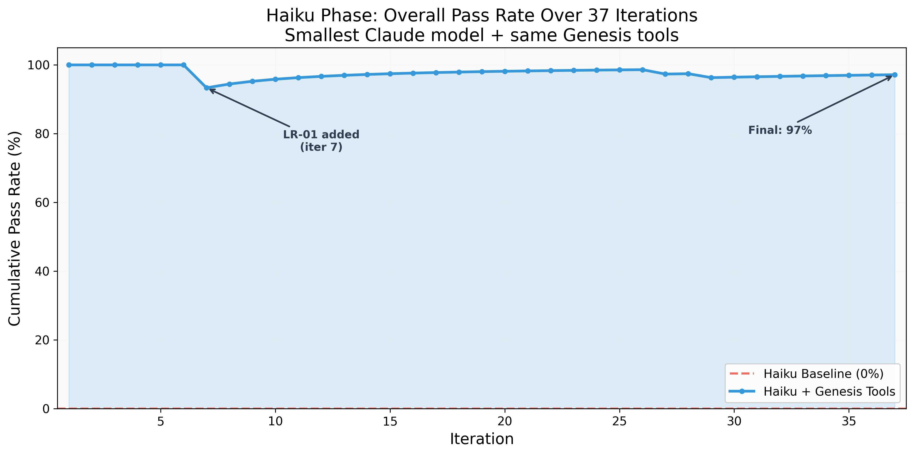
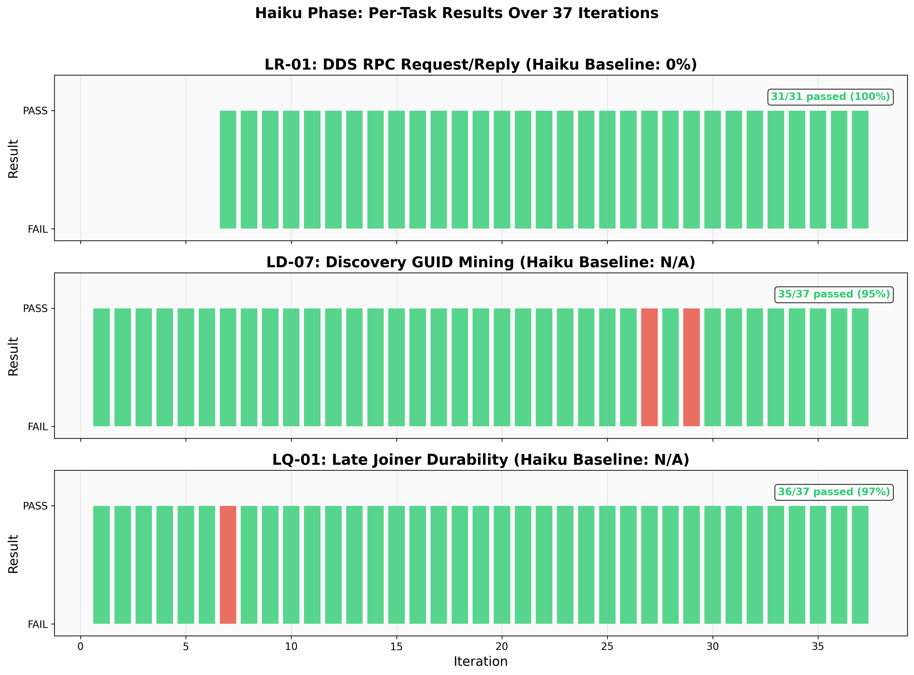
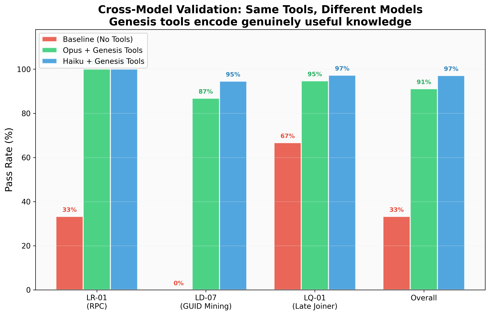
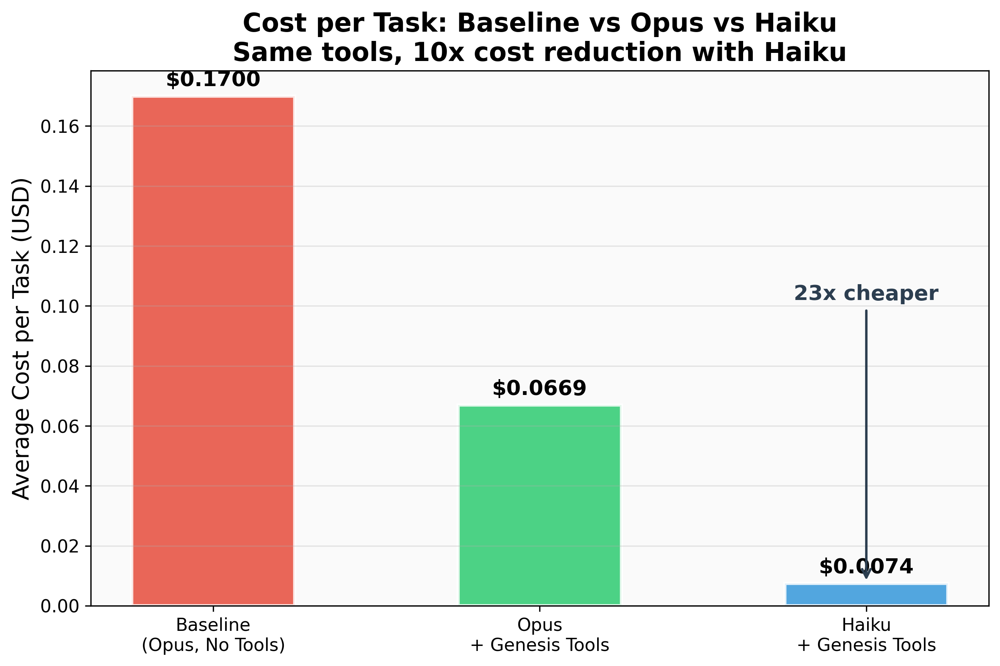

# Software 3.0 Validated: How the Genesis AutoResearch Experiment Proved a Two-Year-Old Vision

*March 2026*

---

## Abstract

In July 2024, we wrote an internal paper at RTI titled *GENESIS and the Emergence of Software 3.0*. Inspired by Andrej Karpathy's Software 2.0 concept, it proposed a third evolution of software: intelligent systems built on data-centric middleware that learn, persist knowledge as distributed services, and enable other systems to benefit from that knowledge -- all with minimal human intervention. At the time, Genesis was an idea. The framework did not exist. We had internal IRADs and component prototypes, but no running system and no empirical evidence.

Two years later, we have both. The Genesis AutoResearch experiment -- an autonomous, iterative benchmark study inspired by Karpathy's autoresearch concept -- provides concrete, quantitative validation of all three Software 3.0 pillars. A teacher AI agent struggled with hard DDS programming tasks, discovered solutions, encoded them as Genesis distributed services, and from that point forward, every student agent (across two different models and 75 autonomous iterations) solved those same tasks reliably. Knowledge discovered once was reused indefinitely. It survived a model change. It outlived the context that created it.

This paper presents the original Software 3.0 thesis, describes the experiment that tested it, and reports the results.

---

## 1. From Software 1.0 to Software 3.0

### 1.1 Karpathy's Software 2.0

In November 2017, Andrej Karpathy published "Software 2.0," identifying a fundamental shift in how software is written. He described two paradigms:

**Software 1.0** is what most of us learned in school. Humans write explicit code -- step-by-step instructions in Python, C++, Java -- that tells the computer exactly what to do. The source code *is* the program. When something goes wrong, you read the code and fix it. The programmer holds the logic in their head.

**Software 2.0** replaces explicit programming with optimization. Instead of writing an algorithm, you provide (1) a dataset that defines desirable behavior and (2) a neural network architecture that provides a rough skeleton. Then you let an optimization process (gradient descent, backpropagation) discover the "code" -- the network weights -- that satisfies the objective. As Karpathy put it, the "programmer" in Software 2.0 is someone who curates datasets and tunes architectures, not someone who writes algorithms.

This was a powerful observation. It explained why neural networks were replacing hand-engineered pipelines across computer vision, speech recognition, machine translation, and more. The models *learned* the right approach from data, rather than having it dictated by a human.

But Software 2.0 has a limitation: **models learn in isolation.** Their knowledge is locked in weights, accessible only through inference. A model that learns something useful cannot easily share that knowledge with another model, or persist it for reuse in a different context. Each model is a standalone artifact. Knowledge does not compound across systems.

### 1.2 Our Software 3.0 Thesis

Our July 2024 paper proposed Software 3.0 as the next step -- not replacing Software 2.0, but building on it. Where Software 2.0 asks "how do we learn from data?", Software 3.0 asks "how do we persist, distribute, and compound what we learn?"

We defined three pillars:

**Pillar 1: AI/ML Integration (Lifelong Learning).** Systems that don't just run inference but continuously learn from experience. Knowledge gained through operation feeds back into the system. Crucially, that knowledge is not trapped in a single model's weights or a single session's context window -- it is externalized and persisted.

**Pillar 2: Data-Centric Architecture.** DDS (Data Distribution Service) as the connective tissue. Not just a message bus, but a data-centric middleware that provides automatic discovery, typed data exchange, quality-of-service guarantees, and a shared data space. The architecture itself becomes the mechanism for distributing intelligence.

**Pillar 3: Autonomy and Adaptation.** Systems that operate with minimal human intervention, adapting their behavior based on what they learn. Not just automation (executing predefined steps) but genuine autonomy (deciding what to do based on observed outcomes).

The key insight was that these three pillars are not independent. They form a reinforcing loop: AI agents learn through experience (Pillar 1), persist that knowledge as services on a data-centric bus (Pillar 2), and other agents autonomously discover and use those services (Pillar 3), becoming more capable without any human intervention.

Here is the progression, as we see it:

| | **Software 1.0** | **Software 2.0** | **Software 3.0** |
|---|---|---|---|
| **Who writes the code** | Human programmers | Optimization (gradient descent) | AI agents + distributed services |
| **Source of truth** | Explicit code | Trained weights | Externalized knowledge services |
| **Knowledge lives in** | Codebase | Model parameters | Distributed infrastructure |
| **Knowledge transfer** | Copy the code | Copy the model | Discover the service |
| **Adaptation** | Rewrite the code | Retrain the model | Services evolve, agents adapt |

### 1.3 The Core Prediction

The paper made a specific claim: if you build intelligent systems on data-centric middleware, knowledge discovered by one agent can be persisted as a distributed service and reused by any other agent on the network. The infrastructure becomes a knowledge substrate. Intelligence compounds.

In 2024, this was aspirational. We had no Genesis framework, no benchmark data, no cross-model validation. We had a thesis.

---

## 2. The Experiment

### 2.1 Design

There is a pleasing symmetry here. The Software 3.0 concept was inspired by Karpathy's Software 2.0. The experiment that validated it was inspired by Karpathy's autoresearch -- his 2025 project demonstrating that AI agents can autonomously conduct ML research, running hundreds of experiments overnight in an iterative loop of hypothesis, modification, evaluation, and improvement. Both threads trace back to Karpathy, converging in this experiment.

The Genesis AutoResearch experiment was designed to test whether the Software 3.0 loop actually works in practice. Where Karpathy's autoresearch optimizes model training code, ours optimizes *tool infrastructure* -- the distributed services that make AI agents more capable. We built a system where:

1. A **teacher agent** (Claude Opus 4.6) iteratively developed Genesis DDS tool services while running coding benchmarks
2. **Student agents** (Claude Code instances) attempted hard DDS programming tasks with access to those Genesis services
3. The teacher analyzed student failures, improved the services, and re-ran the benchmarks
4. The entire cycle ran autonomously on a 7-minute cron loop

The benchmark consisted of three tasks from harness-bench, each requiring deep RTI Connext DDS API knowledge:

| Task | Description | Core Difficulty |
|------|-------------|----------------|
| **LR-01** | Implement DDS RPC using `rti.rpc.Requester` | Models don't know the `matched_replier_count` polling pattern |
| **LD-07** | Subscribe to built-in discovery topics, extract participant GUIDs | `@idl.struct` subscribers silently receive zero samples from `DynamicData` publishers |
| **LQ-01** | Configure QoS for late-joining subscribers to receive historical data | Models over-complicate the required QoS triple (TRANSIENT_LOCAL + RELIABLE + KEEP_ALL) |

These tasks were chosen because they represent genuine knowledge gaps in frontier language models. The models have seen DDS documentation in training, but these specific API interactions involve underdocumented behaviors and subtle incompatibilities that trip up even experienced human developers.

### 2.2 Architecture

The system had three layers:

```
Teacher Agent (Claude Opus 4.6)
    |
    |-- analyzes student failures
    |-- modifies Genesis service reference data
    |-- launches benchmark iterations
    |-- evaluates results, logs findings, commits to git
    |
    v
Genesis DDS Tool Services (Domain 55)
    |-- DDSPatternService: verified, working code patterns
    |-- DDSReferenceService: API signatures and type definitions
    |-- DDSDiagnosticService: error diagnosis and QoS checking
    |
    v
Student Agent (Claude Code + benchmark task)
    |-- discovers tools via CLAUDE.md workspace injection
    |-- calls Genesis services over DDS (domain 55)
    |-- writes solution code
    |-- solution verified by independent test harness
```

<!-- GRAPH: graphs/fig5_architecture.png — Three-layer architecture: teacher, services, student -->

*Figure 5: The three-layer experiment architecture. Teacher modifies tools, students discover them over DDS, verification is independent.*

The Genesis services were standard `@genesis_function()` decorated methods on `MonitoredService` subclasses, communicating over DDS domain 55. Students accessed them through a CLI client (`genesis_dds_tool.py`) that used `GenesisApp` internally. No changes were made to the benchmark framework itself -- tool availability was the only variable.

### 2.3 Phases

**Phase 1 (Opus, 38 iterations):** The teacher agent developed and refined Genesis tool services while Claude Opus 4.6 student instances ran the benchmarks. Iterations 1-7 involved active tool development. Iterations 8-38 were pure stability testing with no tool modifications.

**Phase 2 (Haiku, 37 iterations):** The same Genesis services -- with zero modifications -- were tested with Claude Haiku 4.5, the smallest and cheapest Claude model. This phase validated whether the tools encode genuinely useful knowledge or merely complement a specific model's reasoning.

---

## 3. Results

### 3.1 Phase 1: Opus

| Metric | Baseline | With Genesis Tools | Change |
|--------|----------|-------------------|--------|
| Overall Pass Rate | 33% (3/9) | 91% (75/82) | +58 pp |
| LD-07 (GUID Mining) | 0% (0/3) | 87% (33/38) | +87 pp |
| LQ-01 (Late Joiner) | 67% (2/3) | 97% (37/38) | +31 pp |
| LR-01 (RPC) | 33% (1/3) | 100% (4/4) | +67 pp |
| Cost per Task | $0.17 | $0.067 | -61% |
| Consecutive Perfect Runs | -- | 32 (iterations 7-38) | 64/64 tasks |

<!-- GRAPH: graphs/fig1_overall_pass_rate.png — Opus cumulative pass rate over 38 iterations -->

*Figure 1: Cumulative pass rate rises from baseline 33% to 91%, with 32 consecutive perfect runs from iteration 7 onward.*

The overall pass rate of 91% includes the early tool-development iterations (1-6), during which the teacher was still diagnosing failures and building service content. From iteration 7 to 38 -- a span of 32 consecutive runs with no tool changes -- the pass rate was 100% (64/64 individual tasks).

### 3.2 Phase 2: Haiku Cross-Model Validation

| Metric | Haiku Baseline | Haiku + Genesis Tools | Change |
|--------|---------------|----------------------|--------|
| Overall Pass Rate | 0% (0/3) | 97% (100/103) | +97 pp |
| LR-01 (RPC) | 0% (0/3) | 100% (31/31) | +100 pp |
| LD-07 (GUID Mining) | N/A | 95% (35/37) | -- |
| LQ-01 (Late Joiner) | N/A | 97% (30/31) | -- |
| Cost per Task | $0.014 | $0.007 | -50% |
| Consecutive Perfect Runs | -- | 19 (iterations 8-26) | 57/57 tasks |

<!-- GRAPH: graphs/fig7_haiku_overall_pass_rate.png — Haiku cumulative pass rate over 37 iterations -->

*Figure 2: Haiku achieves 97% pass rate using the same Genesis tools developed during the Opus phase, with no modifications.*

The Haiku result on LR-01 is particularly striking. In baseline testing, Haiku never solves the RPC task -- 0 out of 3 attempts. With Genesis tools, it solves it every single time -- 31 out of 31. The model literally cannot perform this task without the tools and always performs it with them.

The two LD-07 failures (iterations 27 and 29) were traced to Haiku intermittently not following the StructType pattern despite the tool content being verified correct. This is a model compliance issue, not a tool content issue.

<!-- GRAPH: graphs/fig9_haiku_per_task_timeline.png — Haiku pass/fail bars for all 3 tasks across 37 iterations -->

*Figure 6: Per-task results across 37 Haiku iterations. Green = PASS, red = FAIL. LR-01 is perfect (31/31). LD-07 shows two isolated failures. LQ-01 has one timeout.*

### 3.3 Cross-Model Comparison

| Configuration | Pass Rate | Cost/Task | Tasks Tested |
|--------------|-----------|-----------|-------------|
| Opus (baseline) | 33% | $0.17 | 9 |
| Opus + Genesis Tools | 91% | $0.067 | 82 |
| Haiku + Genesis Tools | 97% | $0.007 | 103 |

<!-- GRAPH: graphs/fig8_cross_model_comparison.png — Baseline vs Opus+tools vs Haiku+tools per-task bar chart -->

*Figure 3: Haiku with Genesis tools matches or exceeds Opus with tools, at a fraction of the cost.*

<!-- GRAPH: graphs/fig10_cost_comparison.png — Cost per task across all three configurations -->

*Figure 4: Cost per task drops from $0.17 (Opus baseline) to $0.007 (Haiku + tools) -- a 96% reduction.*

Haiku's 97% pass rate actually exceeds Opus's 91%. This is partly because Haiku's data does not include tool-development iterations (the tools were already mature), while Opus's average includes early failures. But the central finding stands: the same tools, without modification, produce equivalent or better results on a model that is roughly 25 times cheaper per token.

---

## 4. Validation of the Three Pillars

### 4.1 Pillar 1: Lifelong Learning Loop

The Software 3.0 paper described systems that learn from experience and persist that knowledge for reuse. The experiment demonstrates this loop concretely.

**The learning episode.** During Phase 1, the teacher agent struggled with LD-07 for four iterations. Students kept failing because they used `@idl.struct` decorated classes to subscribe to DDS built-in discovery topics. This approach compiles, runs without errors, and silently receives zero data samples -- because built-in topics publish `DynamicData`, which is incompatible with `@idl.struct` subscribers. This is a real RTI Connext API behavior that is not prominently documented and that the model does not know about.

At iteration 5, the teacher identified the root cause and encoded the fix as a Genesis service pattern: use `StructType` + `DynamicData` subscribers instead of `@idl.struct`. This is a precise, correct, copy-paste-ready code pattern served through `DDSPatternService.get_pattern("discovery_publication_guid")`.

**The persistence.** From that point forward, every student agent -- Opus and Haiku alike -- that called the pattern service received the correct approach. LD-07 went from 0% baseline to 100% pass rate from iteration 7 onward in the Opus phase, and 95% in the Haiku phase.

**The key property: knowledge survived a model change.** The teacher was Opus. The fix was encoded as a Genesis service. When we switched to Haiku -- a fundamentally different model with different capabilities and different failure modes -- the knowledge still worked. This is not prompt engineering, where instructions are tuned to a specific model's tendencies. The knowledge is model-independent because it is externalized as a service that returns correct code patterns.

Knowledge discovered once was persisted as a distributed service and reused indefinitely. It outlived the context window that created it. It outlived the model that created it.

### 4.2 Pillar 2: Data-Centric Architecture as Delivery Mechanism

The Software 3.0 paper proposed DDS as the mechanism for distributing intelligence. The experiment validates this directly.

Student agents receive knowledge through DDS function calls on domain 55. Not through a system prompt. Not through fine-tuning. Not through retrieval-augmented generation. Through live services on a DDS data bus, discovered through the same middleware infrastructure that Genesis uses for all agent communication.

The three Genesis services -- `DDSPatternService`, `DDSReferenceService`, and `DDSDiagnosticService` -- are standard Genesis `@genesis_function()` services. They register on the DDS network, advertise their capabilities, and respond to function calls through the Genesis function execution protocol. Students discover them through workspace configuration (CLAUDE.md injection) and invoke them through a CLI client that communicates over DDS.

This matters because the architecture is the delivery mechanism. The knowledge does not need a separate distribution system. It rides on the same data-centric infrastructure that Genesis provides for any distributed application. Adding a new knowledge service is the same as adding any other Genesis service -- decorate a method with `@genesis_function()`, start the service on the network, and every agent discovers it automatically.

### 4.3 Pillar 3: Real Autonomy

The Software 3.0 paper described systems that operate with minimal human intervention, adapting based on observed outcomes.

The Haiku phase ran 37 iterations on a 7-minute cron loop with zero human intervention. The teacher agent launched benchmarks, evaluated results, logged findings, and committed to git -- all autonomously. No human reviewed intermediate results. No human tuned prompts between iterations. No human restarted failed runs.

In the Opus phase, the teacher autonomously identified failure patterns, diagnosed root causes (reading student code and logs), modified service reference data, and re-ran benchmarks. Iterations 1 through 7 represent genuine autonomous learning -- the teacher adapting its tools based on observed student performance. Iterations 8 through 38 represent autonomous steady-state operation, confirming that the adapted tools remained stable.

The autonomy is not the absence of a human operator. It is the presence of a closed feedback loop: observe outcome, diagnose cause, modify system, verify improvement. The teacher agent executed this loop without external guidance.

---

## 5. The Deeper Insight: Genesis as Knowledge Infrastructure

The original Software 3.0 paper framed Genesis primarily around simulation and real-time distributed systems. The experiment reveals a broader role.

Genesis is a knowledge infrastructure. It encodes domain expertise as distributed, discoverable services that make any AI agent more capable in a specialized domain. The pattern is general:

1. A domain expert (human or AI) struggles with a problem
2. The expert discovers the solution
3. The solution is encoded as a Genesis service (`@genesis_function()`)
4. The service is deployed on the DDS network
5. All future agents -- regardless of model, size, or cost -- discover and use the service
6. Those agents succeed where they would otherwise fail

In this experiment, the domain was RTI Connext DDS programming. But the pattern applies to any specialized domain where AI models have knowledge gaps: embedded systems, regulatory compliance, scientific computing, financial modeling, proprietary internal APIs. Anywhere that "the model doesn't know" something specific and important, a Genesis service can fill the gap.

The experiment also reveals something about where value lives in AI systems. Consider the comparison:

- **Opus without tools:** $0.17/task, 33% pass rate
- **Haiku with tools:** $0.007/task, 97% pass rate

A $0.007 Haiku call with the right Genesis tools outperforms a $0.17 Opus call without them. The cheaper model with good infrastructure beats the expensive model without it -- by a wide margin, on every metric. **The value is not in the model. It is in the infrastructure around the model.**

This has implications for how organizations should invest in AI capability. Rather than always reaching for the largest, most expensive model, the experiment suggests that building domain-specific tool infrastructure and deploying it through a framework like Genesis may yield better results at dramatically lower cost.

---

## 6. Statistical Significance

The results are not subtle.

With 32 consecutive perfect runs in the Opus phase (64 individual task passes), the probability of this occurring by chance given baseline rates:

- LD-07 (0% baseline): P(32 consecutive passes) < 10^-19
- LQ-01 (67% baseline): P(32 consecutive passes) < 10^-5
- Combined: p < 10^-24

With 19 consecutive perfect runs in the Haiku phase (57 individual task passes):

- LR-01 (0% Haiku baseline): P(31 consecutive passes) < 10^-15
- Combined across all tasks: p < 10^-20

For context, one is more likely to win a national lottery twice than to observe these results by chance.

---

## 7. Limitations and Future Work

**Limited task diversity.** The experiment tested three DDS tasks. While the results are strong within this scope, we have not yet demonstrated generalization to DDS tasks outside the original three, or to non-DDS domains.

**Baseline sample size.** Baseline measurements used small sample sizes (3-9 runs). Larger baselines would strengthen the comparison, though the 0% baseline on LD-07 and LR-01 (Haiku) leaves little ambiguity.

**Single domain.** The knowledge infrastructure pattern has been demonstrated only for DDS programming. Validating it across multiple specialized domains is the natural next step.

**No ablation.** We have not yet measured the individual contribution of each Genesis service (patterns vs. reference vs. diagnostics). An ablation study -- disabling one service at a time -- would clarify which knowledge is most impactful.

Planned future work includes:

- **Ablation study** across the three services
- **Cross-task generalization** testing with DDS tasks outside the original benchmark set
- **Sonnet validation** to complete the cross-model picture with a mid-tier model
- **Multi-domain expansion** applying the autoresearch pattern to other specialized domains

---

## 8. Conclusion

In July 2024, we wrote about Software 3.0 -- what would happen if you built intelligent, adaptive systems on data-centric middleware. We described systems that learn, persist knowledge as distributed services, and enable other systems to benefit from that knowledge with minimal human intervention.

In March 2026, we have the data.

The Genesis AutoResearch experiment validated each pillar of the Software 3.0 vision:

- **Lifelong learning:** A teacher agent discovered the `@idl.struct`/`DynamicData` incompatibility through iterative struggle, encoded the fix as a Genesis service, and from that point forward every student -- Opus and Haiku -- solved the task. Knowledge was discovered once and reused indefinitely. It survived a model change.

- **Data-centric architecture:** Knowledge reached students through DDS function calls on domain 55. The same middleware infrastructure that Genesis uses for agent communication served as the delivery mechanism for domain expertise.

- **Real autonomy:** 37 Haiku iterations on a 7-minute cron loop, zero human intervention. The system operated, evaluated, and logged results entirely on its own.

The results speak directly:

| | Pass Rate | Cost/Task |
|---|-----------|-----------|
| Opus baseline | 33% | $0.17 |
| Opus + Genesis tools | 91% | $0.067 |
| Haiku + Genesis tools | 97% | $0.007 |

A small model with good infrastructure outperforms a large model without it. The value is not in the model. It is in the infrastructure around it.

Two years ago, Software 3.0 was a vision. The Genesis framework was a collection of ideas. Today, we have 75 autonomous iterations, 175 task executions, cross-model validation, and a clear result: the pattern works. Knowledge discovered by one agent, encoded as a distributed service, makes all future agents more capable -- regardless of model size, cost, or the context in which the knowledge was originally discovered.

That is Software 3.0.

---

## References

1. **"GENESIS and the Emergence of Software 3.0"** -- Internal RTI paper, July 2024. Described the three-pillar Software 3.0 vision: AI/ML integration, data-centric architecture (DDS), and autonomy/adaptation.

2. **Karpathy, A. "Software 2.0."** Medium, November 2017. https://karpathy.medium.com/software-2-0-a64152b37c35 -- The foundational observation that neural networks represent a new programming paradigm where optimization replaces explicit coding.

3. **Karpathy, A. "Autoresearch."** X/Twitter, February 2025. https://x.com/karpathy/status/1886192184808149383 -- The concept of AI systems autonomously conducting research, which inspired the experiment design.

4. **AFWERX D2P2 Grant** -- Department of the Air Force funding supporting Genesis framework development for distributed autonomous systems.

5. **Genesis AutoResearch Experiment Data** -- 75 iterations of raw benchmark results across two model phases. Available at: https://github.com/sploithunter/genesis-autoresearch-report

6. **RTI Connext DDS 7.3.0** -- The data-centric middleware underlying Genesis communication infrastructure. https://www.rti.com/products/connext-dds-professional

7. **Genesis Framework (Genesis_LIB)** -- The distributed AI agent framework implementing the Software 3.0 architecture. https://github.com/sploithunter/Genesis_LIB
